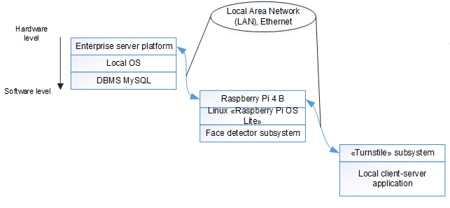

## Turnstile face detection and identification system
Part of my diploma project, uses tools from
'OpenCV' and 'face_recognition' ('dlib') libraries to detect and identify faces.

Project purpose is further automation of existing 
turnstile security system while also increasing it's reaction time
and security.

Methods used: 
- Haar Cascade + LBPH ('alg1', 'OpenCV'); 
- CNN ('alg2', 'face_recognition')

System structure (simplified):  

Project structure:  
. - *root (this folder)*  
.\ComputerVision - *face detection and identification subsystem*  
.\GateSimulator - *turnstile subsystem simulator*   
.\MySQL - *SQL script for table creation*  

In case if someone finds this project and decides to run it:
1. Configure && launch turnstile 'GateSimulator' program
2. Set up MySQL server database && table
3. Configure && launch 'ComputerVision' program
- Note that 'GateSimulator' and 'ComputerVision' must be launched 
as 2 different projects. Or do whatever if you know how. It's freeware anyways.

**Note:** this is a prototype - project uses HTTP protocol for cross-platform 
communication instead of proper TCP/UDP connection.  
**Note:** this release contains no pre-trained LBPH model nor 
face images

